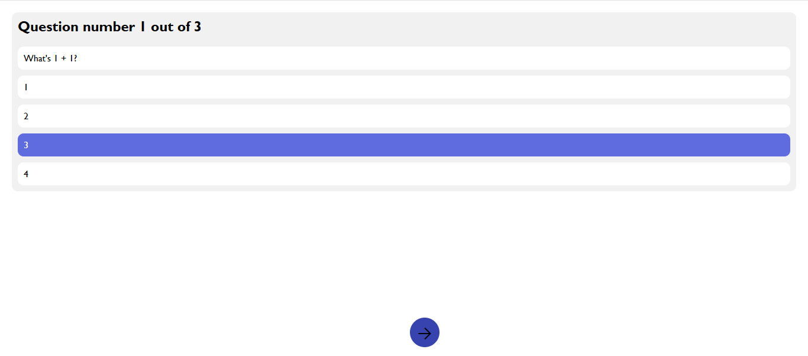

# Introduction
quiz-app is a completly educational project for getting better at front-end. this project does not have any backend so it can not save up any information about the user.

## Technologies used
- Vite
- TypeScript
- React

## Demonstration



# How to run on your local device

```shell
npm install
npm run dev
```

and that is it.